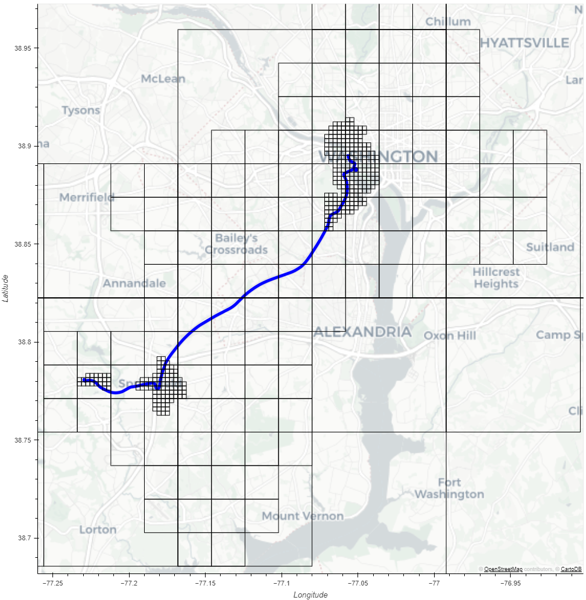

# Synopsis
## Forensics Question
- Can we recover location traces of map tiles rendered by Google Maps based on user interaction?

## OS Version
The findings of this research apply to several Google Maps application versions running at least the following Android OS:

- Android (Automotive) 10 and 11
- Android 12 (AVD)
- Android 13 (Josh Hickman's image)
- Android 14 (AVD)

## Tools
Ghidra, Frida, Jadx, DB Browser for sqlite, Python

# Introduction
This study shows an in-depth analysis of forensic artifacts from Android applications using the Maps SDK.

During our forensic investigation on an Android Automotive system we discovered a database with encrypted records in the userdata folder of Google Maps. 
This caught our attention because it may store relevant historical location data. 
Therefore, we started reverse engineering the data-format, interpreting and visualizing this database. 
These efforts resulted in a clean analysis of the `map_cache.db` which allows us to visualize the recently navigated routes with Android applications that use the Maps SDK, like Google Maps. 

Our findings apply to forensically acquired images from systems running Android OS like Android Automotive and Android OS running on smartphones. 
We will describe the reverse engineering, interpretation and visualization 
efforts of the `map_cache.db` in detail, but will not describe the acquisition of infotainment systems running Android Automotive.

# Outline
This blog consists of 4 main sections:

1. Background information on Android Automotive and initial triage on the `map_cache.db`
2. The reverse engineering process used to decrypt `map_cache.db` concluding with the decryption method
3. Interpretation and visualization of the decrypted `map_cache.db`
4. Conclusion and discussion of the results

Especially regarding the description of the reverse engineering process, we hope to encourage others to delve deeper when encountering encrypted data surrounded with hints of the forensic relevance of its decrypted contents.

# Background
The Android Automotive platform is increasingly popular for major vehicle manufacturers (OEMs) to incorporate in their infotainment systems. 
Therefore, there is a growing interest among forensic investigators in analysing Android Automotive.

Not to be confused with [Android Auto](https://source.android.com/docs/automotive/start/what_automotive#android-automotive-android-auto), which only mirrors the screen of your Android device on the vehicle's screen, Android Automotive is actually the Android operating system as we know it from the Mobile phone world. 
Hence it uses the same codebase as Android OS, along with additional automotive specific features.

Just as with mobile phone OEMs, automotive OEMs can choose to license Google's services, which are called Google Automotive Services ([GAS](https://source.android.com/docs/automotive/start/what_automotive#google-automotive-services-gas)) for automotive applications.
Doing so enables for example the use of Google Maps from the vehicle infotainment system natively.

During our investigation on a system running Android Automotive with GAS, we eventually were able to obtain root access.
In our next step we successfully acquired a decrypted logical image of Android Automotive system which was encrypted with Android File Based Encryption (FBE).

# The `map_cache.db`
With the decrypted forensic image of the Android Automotive system, we started our forensic analysis. 
The main application of interest was Google's Maps application. 
Most of its artifacts were nicely parsed by commercial tools and [ALEAPP](https://github.com/abrignoni/ALEAPP) already. 
A relatively large database named `map_cache.db` (a few hundred megabytes for that system) however, remained uninterpreted by these tools. 

Due to the name of this database, it was assumed it contains cached registries for a tiled map application like Google Maps. 
From our experience in vehicle forensics, map tile metadata can be a relevant source of location retrieval, especially when they include timestamps.
Such information is used in navigation applications for route calculation and rendering maps to the screen. 
If we can visualize these artifacts in a forensic manner, we may be able to tell what routes the device recently traveled.

Even with the lack of support from commercial and open-source tools of this database, it was interesting to see little to no research was published on this specific database.
Furthermore, this database seems to be in use not only by Google's Maps application but also other applications which rely on the [Maps SDK](https://developers.google.com/maps/documentation/android-sdk) for displaying maps.

This database, called `map_cache.db` was found on the following location: 

```commandline
emu64xa:/data # ls -l /data/media/0/Android/data/com.google.android.apps.maps/cache/diskcache/
total 6944
-rw-r----- 1 u0_a151 ext_data_rw 7061504 2024-05-24 07:46 map_cache.db
-rw-r----- 1 u0_a151 ext_data_rw   32768 2024-05-24 07:46 map_cache.db-shm
-rw-r----- 1 u0_a151 ext_data_rw       0 2024-05-24 07:46 map_cache.db-wal
```

The database itself appeared to be unencrypted. 
This allowed us to take a look at the database schema and contents. 
A view of this schema was obtained using [DB Browser for SQLite](https://sqlitebrowser.org/). 
Especially the `tiles` table caught our interest: 


Inside the `tiles` table, the columns `metadata` and `data` did not contain anything meaningful yet.
The high entropy data blobs in combination with the columns: `metadata_nonce` and `data_nonce` clearly suggested the `metadata` and `data` columns were encrypted.

Even though specifically the file `map_cache.db` yielded little previous research information, there have been some mentions of tile caches in other forensic sources. 
[This blog](https://www.digitalforensics.io/examining-maptiles-from-ios/) and its [follow up blog](https://www.digitalforensics.io/ios-forensics-data-hidden-within-map-cache-files/) describe the possibility of retrieving  tile content from ios and hint at its relevance but did not provide further information. 

Since this database is fairly large, currently unsupported by other common tools and the possible forensic value of map tile metadata, it was decided to dig deeper into this database.

# Reversing
Since certain columns of interest seem to be encrypted, the first goal was to find a method for decrypting the columns.
This required some reverse engineering which will be described in more detail in this chapter. 
Hopefully this inspires the reader to apply the described reversing approaches in other projects. 

## Setting the reversing goal
Getting started with reversing, it was kept in mind the Maps app will have to use the tile cache and decrypt its content at some point during execution.
After all, the whole purpose of a cache is to reuse already downloaded data.
In order to be able to decrypt the contents of the `map_cache.db` it is therefore essential to find the decryption or encryption routines.
Specifically, one needs to find the key material and encryption scheme responsible for converting the data from plaintext to ciphertext and vice versa.

So during the reversing process, it was important to find:

- The cryptographic scheme used on the database blobs
- The key material used for decryption

## Static Analysis
To start with static reverse engineering, the Android Package (apk) of `com.google.android.apps.maps` was pulled from the Android system by first locating the Maps apk file:

```commandline
emu64xa:/data # pm list packages -f | grep maps
package:/product/app/Maps/Maps.apk=com.google.android.apps.maps
```

And then pull the apk file called `Maps.apk` from this directory with `adb` to a directory of the host (in this case `/tmp/`):

```commandline
➜  ~ mkdir /tmp/maps
➜  ~ adb pull /product/app/Maps/Maps.apk /tmp/
```

This apk file is loaded into [jadx](https://github.com/skylot/jadx). 
Jadx decompiles the Dalvik bytecode inside the apk to readable Java code.
After decompilation the string `map_cache.db` was searched in the decompiled code.
This yields some results but did not give a lot of insights on how the database was being handled. 
The `defpackage` class references mainly the file creation and not much more:


Since an apk file is just an extension to the zip format, it is also possible to unzip the `Maps.apk`.
Then a simple `grep` operation to the unzipped content gave more insights on the usage of the `map_cache.db`:

```commandline
➜  ~ cd /tmp/maps
➜  maps unzip -q ../Maps.apk
➜  maps grep -ri map_cache.db
grep: classes2.dex: binary file matches
grep: lib/x86_64/libgmm-jni.so: binary file matches
grep: classes6.dex: binary file matches
```

The shared library `libgmm-jni.so` seems to contain references to the `map_cache.db`. 
Since these filetypes typically contain native code, the library was loaded into [Ghidra](https://www.ghidra-sre.org/) for disassembly. 
Now it is possible to search for the string `map_cache.db` in the strings and cross-references identified by Ghidra. 
This also lead to the discovery of the string: `map_cache.key`. 
Both strings are referenced three times in the disassembled code, of which all of them occur in the same function as shown below:


Due to the complexity of this routine (labeled as `FUN_00aef8c2` in the screenshot above), it is not helpful to show all its instructions nor is it efficient to understand the complete routine line by line. 
Only a closer look into the surrounding instructions where `map_cache.key` occurs show descriptive error-handling messages mentioning this file is a *"database key file"*. 
This could indicate the file contains the key material needed to decrypt the contents of the `map_cache.db`.

## Analysis of the key file
With the new insights it was relevant to retrieve the `map_cache.key` from the android device. 
With the `find` operation the possible key file was quickly located. 
It occurs in two locations, and both files are identical:

```
emu64xa:/ # find /data -type f -iname "map_cache.key"
/data/user/0/com.google.android.apps.maps/app_/testdata/map_cache.key
/data/data/com.google.android.apps.maps/app_/testdata/map_cache.key
emu64xa:/ # diff /data/user/0/com.google.android.apps.maps/app_/testdata/map_cache.key /data/data/com.google.android.apps.maps/app_/testdata/map_cache.key
emu64xa:/ # echo $?
0
```

This is because on Android the contents in `/data/user/0/` have in this case a soft-link to `/data/data/`.

Similar to the apk file, the `map_cache.key` file is pulled again and its contents are inspected with `xxd`:

```commandline
➜  ~ adb pull /data/user/0/com.google.android.apps.maps/app_/testdata/map_cache.key /tmp
/data/user/0/com.google.android.apps.maps/app_/testdata/map_cache.key: 1 file pulled. 0.0 MB/s (46 bytes in 0.013s)
➜  ~ file /tmp/map_cache.key
/tmp/map_cache.key: data
➜  ~ xxd /tmp/map_cache.key
00000000: 0a10 9848 172d d0ae bb73 8bb4 77a2 4622  ...H.-...s..w.F"
00000010: e5f2 1210 55fa 0035 e37e d93d b441 e4aa  ....U..5.~.=.A..
00000020: 7785 a349 18b4 9c8b cbf2 f0c6 ab4c       w..I.........L
```

It shows high entropy content, which is reasonable for a cryptographic key. The filesize however indicates 
more than just a key may be stored in this file. The data could be serialized, which is tested by using 
[`protobuf_inspector`](https://github.com/mildsunrise/protobuf-inspector):

```commandline
➜  ~ protobuf_inspector < /tmp/map_cache.key
root:
    1 <chunk> = bytes (16)
        0000   98 48 17 2D D0 AE BB 73 8B B4 77 A2 46 22 E5 F2                          .H.-...s..w.F"..
    2 <chunk> = bytes (16)
        0000   55 FA 00 35 E3 7E D9 3D B4 41 E4 AA 77 85 A3 49                          U..5.~.=.A..w..I
    3 <varint> = 5500895737185226292
```

Having two random sequences of 16 bytes, increases the chance that this file contains a valid AES key which is always 16 bytes (or 128 bits) long. 
While these results are promising, there is still no knowledge how this possible key-material can be applied to the ciphertext from the database. 

## Following JNI calls
Given a possible key-file (the `map_cache.key`) and SQLite database with encrypted content (`map_cache.db`), the next step is to understand how the key-material is applied to the ciphertext of the database. 
Again, it is kept in mind the Maps app has to use the file cache and decrypt its content. 
It is therefore expected the key-material will be applied whenever a handle to the database is set. 
The function responsible for this is found as a [JNI](https://developer.android.com/training/articles/perf-jni) (Java Native Interface) method in `libgmm-jni.so`:


The method of interest is called: `nativeOpenOrCreateSqliteDiskCache`. 
This method is referenced in `Maps.apk` inside `NativeSqliteDiskCacheImpl` class in the `com.google.android.libraries.geo.mapcore.internal.store.diskcache`.
Inspecting this class using jadx, the following native methods may also be of interest:

```java
 public static native byte[] nativeSqliteDiskCacheGetTile(long j, byte[] bArr);
 public static native byte[] nativeSqliteDiskCacheGetTileMetadata(long j, byte[] bArr);
 public static native boolean nativeSqliteDiskCacheHasTile(long j, byte[] bArr);
```

The most interesting method is `nativeSqliteDiskCacheGetTileMetadata` as it might be related to the `metadata` column of the database. 
To gain knowledge on the workings of this method, it is traced with [frida](https://frida.re/) while using the application. 
This shows the values given to the method and what it returns:

```commandline
➜  ~ frida-trace -U -f  com.google.android.apps.maps -j '*!nativeSqliteDiskCacheGetTileMetadata'
Instrumenting...
NativeSqliteDiskCacheImpl.nativeSqliteDiskCacheGetTileMetadata: Auto-generated handler at "/home/francis/__handlers__/com.google.android.libraries.geo.mapcore.internal.store.diskcache.NativeSqliteDiskCacheImpl/nativeSqliteDiskCacheGetTileMetadata.js"
Started tracing 1 function. Press Ctrl+C to stop.
           /* TID 0x1b71 */
   646 ms  NativeSqliteDiskCacheImpl.nativeSqliteDiskCacheGetTileMetadata("132255957220816", [10,8,108,111,114,101,45,114,101,99,18,5,101,110,45,85,83,42,9,8,15,16,-116,-125,1,24,-58,84,58,2,85,83,82,19,108,111,114,101,45,114,101,99,46,115,105,103,110,101,100,111,117,116,64])
   647 ms  <= [10,53,10,8,108,111,114,101,45,114,101,99,18,5,101,110,45,85,83,42,9,8,15,16,-116,-125,1,24,-58,84,58,2,85,83,82,19,108,111,114,101,45,114,101,99,46,115,105,103,110,101,100,111,117,116,64,24,-15,-15,-95,-6,-6,-1,-1,-1,-1,1,32,0,48,-57,-53,-8,-7,-5,49,56,-121,-126,-51,-47,-5,49,64,1,72,-75,5,82,16,71,90,122,119,101,113,89,87,100,66,99,73,73,79,103,82,88,-57,-109,-33,-48,-5,49]
           /* TID 0x1b6a */
   649 ms  NativeSqliteDiskCacheImpl.nativeSqliteDiskCacheGetTileMetadata("132255957220816", [10,1,109,18,5,101,110,45,85,83,42,8,8,14,16,-58,65,24,-93,42,58,2,85,83])
   649 ms  <= [10,24,10,1,109,18,5,101,110,45,85,83,42,8,8,14,16,-58,65,24,-93,42,58,2,85,83,24,-20,-29,-111,-72,5,32,0,48,-87,-93,-38,-92,-123,50,56,-87,-53,-8,-7,-5,49,64,1,72,-75,5,82,26,69,73,71,99,49,77,111,67,71,98,97,88,55,51,81,55,48,103,111,103,73,74,105,117,65,103,88,-87,-109,-33,-48,-5,49]
```

These input and output values are revealed while manually zooming and panning around the map in the application.
Upon visual inspection, these values are low of entropy and does not seem to be encrypted. 
One of the values from above, as retrieved with frida, is taken and processed with python to write the input and output to a file:

```python
In [11]: open('/tmp/input','wb').write(bytes(x & 0xff for x in [10,1,109,18,5,101,110,45,85,83,
    ...: 42,8,8,14,16,-58,65,24,-93,42,58,2,85,83]))
Out[11]: 24

In [12]: open('/tmp/output','wb').write(bytes(x & 0xff for x in [10,24,10,1,109,18,5,101,110,45
    ...: ,85,83,42,8,8,14,16,-58,65,24,-93,42,58,2,85,83,24,-20,-29,-111,-72,5,32,0,48,-87,-9
    ...: 3,-38,-92,-123,50,56,-87,-53,-8,-7,-5,49,64,1,72,-75,5,82,26,69,73,71,99,49,77,111,6
    ...: 7,71,98,97,88,55,51,81,55,48,103,111,103,73,74,105,117,65,103,88,-87,-109,-33,-48,-5
    ...: ,49]))
Out[12]: 88
```

Now the input and output is checked again with `protobuf_inspector`: 

```commandline
➜  ~ protobuf_inspector < /tmp/input
root:
    1 <chunk> = "m"
    2 <chunk> = message:
        12 <32bit> = 0x53552D6E / 1398091118 / 9.15590e+11
    5 <chunk> = message:
        1 <varint> = 14
        2 <varint> = 8390
        3 <varint> = 5411
    7 <chunk> = "US"

➜  ~ protobuf_inspector < /tmp/output
root:
    1 <chunk> = message:
        1 <chunk> = "m"
        2 <chunk> = message:
            12 <32bit> = 0x53552D6E / 1398091118 / 9.15590e+11
        5 <chunk> = message:
            1 <varint> = 14
            2 <varint> = 8390
            3 <varint> = 5411
        7 <chunk> = "US"
    3 <varint> = 1459909100
    4 <varint> = 0
    6 <varint> = 1719406072233
    7 <varint> = 1716900472233
    8 <varint> = 1
    9 <varint> = 693
    10 <chunk> = "EIGc1MoCGbaX73Q70gogIJiuAg"
    11 <varint> = 1716814072233

```

This output shows the JNI method uses protobufs as both input argument and return value. 
The return value of the traced method also contains its exact input but with some more data added to it. 
While the protobuf encoding scheme remains unknown, the presence of the string `m` seems to reference one of the values in the database. 
The analysed `map_cache.db` contains a column `layer_id` in the
`tiles` table with the value `m`:


The input and return value of the traced JNI method does not seem to be encrypted. 
This suggests a tile is queried by the application using a serialized protobuf structure and retrieves a plaintext response back.
This means the encryption layer must be handled inside the native library, as no traces of encryption are found in the decompiled application.

## Back to Ghidra
To understand the relevant cryptographic routines, the `libgmm-jni.so` native library needs to be analysed more thoroughly. 
This means the library will be loaded into Ghidra again. 
For JNI native libraries it is common to write the source in C++ according to [Android documentation](https://developer.android.com/training/articles/perf-jni). 
Reading disassembled C++ is a bit more involved compared to C or Assembly, but fortunately most of the android shared libraries contain RunTime Type Information (RTTI). 
When analysed properly, it will be easier to identify constructor and destructor functions using this information.
When loading the library into Ghidra, make sure to run the prototype script: `RecoverClassesFromRTTIScript.java`. 
Now more readable namespaces will be visible, and it is up to the reverse engineer to define and modify data structures to label the routines more accurately.

After recovering classes from RTTI, the function of interest that references `map_cache.db` and `map_cache.key` is now slightly less opaque.
It now shows usage of several classes of the `maps_gmm_tiles` namespace as shown below:


The symbol tree as shown above shows some readable strings that provide a good indication of the possible caching mechanism. 
Unfortunately though, the functions marked as interesting earlier such as `nativeOpenOrCreateSqliteDiskCache`or `nativeSqliteDiskCacheGetTileMetadata` still looked very complex when looking into the decompiled code.

It does not make sense to keep spending time into functions deemed too complex. 
At this point it was time to step back and try another path to get a better understanding of the cryptographic routines. 
So the next step was searching for strings related to decryption. 
One interesting result was a print statement containing the words: *"Decryption failure"*. 

Print statements and error handling are very valuable when trying to reverse engineer because they are often very verbose and provide some information about the surrounding code. 
In this case, the print statement was inside an if-statement.
This means that the negation of the *"Decryption failure"* result should  lead to the correct decryption. 

Tracing back to the caller of this function leads to a virtual function table (also called a vtable) of an object called `maps_gmm_offline::common::(anonymous_namespace)::AesGcmDecryptor`. 
One of the functions inside `AesGcmDecryptor`'s vtable wraps another function that references the string: `third_party/openssl/boringssl/src/crypto/fipsmodule/cipher/aead.c`.
This was recognised as a string refering to the open source cryptography library [Google's fork of OpenSSL called: BoringSSL](https://github.com/google/boringssl/tree/master). 
It is a crucial find because the open source implementation provides valuable information on variable and function names in the disassembled code in Ghidra.

## Matching open source code to decompiled code
To be able to match the open source functions to the decompiled code of `libgmm-jni.so`, the BoringSSL implementation and decompiled code are compared. 
The goal in this step is to find code snippets in the open source implementation that also occur in the decompiled code. 
This step is visualized in the figure below, and followed by a textual description of the process.  


A snippet of the open source code of BoringSSL is shown on the left. 
The undefined function referencing this specific file in BoringSSL is shown on the right of the figure.

The verbosity of the string `third_party/openssl/boringssl/src/crypto/fipsmodule/cipher/aead.c` in `libgmm-jni.so` hints to a logging, debugging or error handling functionality. 
The implementation of `aead.c` includes the headerfile `err.h` which uses C macro's to mark error conditions as follows:

```c
#define OPENSSL_PUT_ERROR(library, reason) \
  ERR_put_error(ERR_LIB_##library, 0, reason, __FILE__, __LINE__)
```

This is where the pattern matching begins, because the `ERR_put_error` function of `err.h` requires the same amount of parameters as `FUN_00f93bdc` in `libgmm-jni.so`. 
Additionally, exactly where the `__FILE__` parameter would be expected in the function `FUN_00f93bdc`, a reference to the BoringSSL `aead.c` file is made. 
Lastly, filling the `__LINE__` parameter in the function `FUN_00f93bdc` leads to `uVar2` which is assigned to multiple values, one for example is `191`.

Looking at line `191` in `aead.c` a function named `OPENSSL_PUT_ERROR` is called, which brings us unsurprisingly
back to the C macro in `err.h`.

Going over all functions inside `aead.c` and their usage of the `OPENSSL_PUT_ERROR` macro enables identification of this specific function through the line number and error reason. 
Admittedly some luck comes into play with the line numbers being unchanged.
The error codes are probably less likely to change over time.

Obviously, this pattern matching technique can be reused for the other functions that reference boringssl code to quickly identify many more functions.
Combining this with a bit of research on the specifics of BoringSSL, along with type information and data structures, the goal to identify the cryptographic scheme is now within reach.

## The cryptographic scheme
The previous section shows how BoringSSL code is used inside the `AesGcmDecryptor` class.
This class name hints the scheme is using the AES block-cipher in counter-mode, specifically GCM (Galois Counter Mode).
With further reversing, the BoringSSL function [aead_aes_gcm_open_gather_impl](https://github.com/google/boringssl/blob/afd52e91dfed27ab7193be040f067900947b14ac/crypto/fipsmodule/cipher/e_aes.c#L1021) leads to the following implementation:

```c
static int aead_aes_gcm_open_gather_impl(const struct aead_aes_gcm_ctx *gcm_ctx,
                                         uint8_t *out,
                                         const uint8_t *nonce, size_t nonce_len,
                                         const uint8_t *in, size_t in_len,
                                         const uint8_t *in_tag,
                                         size_t in_tag_len,
                                         const uint8_t *ad, size_t ad_len,
                                         size_t tag_len)
```

The parameters in this function are described as follows: 
- `aead_aes_gc_ctx` is a pointer to a context structure containing the AES key
- `out` is a pointer to the output buffer
- `in` is a pointer to the buffer containing the input (of size `in_len`)
- `nonce` is a pointer to the buffer containing the nonce (of size `nonce_len`)
- `in_tag` is a pointer to the buffer containing the tag (of size `in_tag_len`)
- `ad` is a pointer to the buffer containing the additional data (of size `ad_len`)

The `tag` or `ad` parameter are only responsible for authenticating the decrypted content as described 
in [authenticated encryption](https://en.wikipedia.org/wiki/Authenticated_encryption) and therefore not further explained here.

## Writing and executing a Frida script
The parameters are interesting to inspect when the responsible function is called. 
To get this information, a Frida script is written in JavaScript to intercept the decryption function and read the values assigned to the 
function parameters:

```javascript
var libgmm = Process.findModuleByName('libgmm-jni.so')  // Get a hold of the loaded library in the current process
var decryptfn = 0xf9dbab - 0x100000  // Offset of our function of interest relative to the library base (which is 0x100000 by default in Ghidra)
console.log(libgmm.base)

Interceptor.attach(ptr(parseInt(libgmm.base) + decryptfn), {
    onEnter: function (args) {
        console.log("Key:")
        console.log(args[0].readByteArray(0x10))  // Key size is 0x10
        console.log("Nonce:")
        console.log(args[2].readByteArray(parseInt(args[3])))  // Nonce size is 0x0C
        console.log("Input:")
        console.log(args[4].readByteArray(parseInt(args[5])))
        console.log("Tag:")
        console.log(args[6].readByteArray(parseInt(args[7])))
        console.log("Additional data:")
        console.log(args[8].readByteArray(parseInt(args[9])))

        // We need to store the pointer to the output buffer in our interceptor object for use in the onLeave hook
        this.outptr = args[1]
    },
    onLeave: function (retval) {
        // Read what was written to the output buffer after decryption
        console.log("Output:")
        console.log(this.outptr.readByteArray(0x20))
        console.log('\n')
    }
});
```

This Frida script can be launched from the command line as follows while the Maps application is running on the foreground:

```commandline
frida -U -F -l hook_decrypt.js
```

This instructs Frida to hook in the application which currently runs on the foreground (`-F`) on the device which is connected over 
USB (`-U`) while executing the script (`-l`) called `hook_decrypt.js`.

As soon as the application calls the function in `libgmm-jni.so` at offset `0xf9dbab - 0x100000`, the Frida script intercepts the call. 
When intercepted, the script prints the parameters of the function to console as instructed.

Now a call to the function needs to be triggered. 
This can be achieved by panning and zooming the Maps application. 
This user interaction prints the parameters as described in the previous section to the console.

Using `frida-trace` and the Frida script concurrently, it is possible (with some timing) to match both outputs to the function call and cryptographic values. 
By doing so, it was revealed the decryption function gets called for (at least) both `metatdata` and `data` columns from the `tiles` or `resources` table.

This is for example the output using `frida-trace`:

```commandline
           /* TID 0x3e74 */
207579 ms  NativeSqliteDiskCacheImpl.nativeSqliteDiskCacheGetTileMetadata("132255957209520", [10,1,109,18,5,101,110,45,85,83,42,8,8,12,16,-78,16,24,-56,10,58,2,85,83])
207585 ms  <= [10,24,10,1,109,18,5,101,110,45,85,83,42,8,8,12,16,-78,16,24,-56,10,58,2,85,83,24,-44,-102,-108,-8,3,32,0,48,-51,-12,-30,-52,-123,50,56,-51,-100,-127,-94,-4,49,64,1,72,-75,5,82,26,69,74,71,100,49,77,111,67,71,84,80,51,101,86,53,104,115,116,70,54,73,73,117,71,65,81,88,-51,-28,-25,-8,-5,49]
```

And the corresponding cryptographic values of the `metadata` column printed by `hook_decrypt.js`: 

```commandline
...
Key:
           0  1  2  3  4  5  6  7  8  9  A  B  C  D  E  F  0123456789ABCDEF
00000000  e0 5f 44 fd 7e 69 2e fe 3f 2b 19 e8 68 07 d7 f2  ._D.~i..?+..h...
Nonce:
           0  1  2  3  4  5  6  7  8  9  A  B  C  D  E  F  0123456789ABCDEF
00000000  58 34 d2 10 96 c6 c9 e4 00 00 00 00              X4..........
Input:
           0  1  2  3  4  5  6  7  8  9  A  B  C  D  E  F  0123456789ABCDEF
00000000  ef 11 2f d8 b0 af 48 af 24 c2 e5 c4 3a d0 8d 33  ../...H.$...:..3
00000010  2c 15 f1 2f b5 c4 0c 28 f6 80 6b 42 1a 3b 23 0a  ,../...(..kB.;#.
00000020  b7 7c cd a9 02 9b 3c f6 af 10 89 9e 3a 25 af 23  .|....<.....:%.#
00000030  97 eb ea 51 78 06 d3 10 b1 41 43 78 03 ce 63 fd  ...Qx....ACx..c.
00000040  2a c0 0e de 20 f5 cc 86 c7 ff 1f 2b 90 11 40 5a  *... ......+..@Z
00000050  41 2d 58 ca 8b 63 33 a2 28 98 65 22 36 6d a0 e2  A-X..c3.(.e"6m..
00000060  ad 8b 5d b8 73 41 d5 2e 74 9e 6c af 61 19 05 c3  ..].sA..t.l.a...
00000070  f5 55 af e6 bf cd e7 d5 4f f1 20 be f5 1d eb 2f  .U......O. ..../
00000080  fc 2d a3 b5 bf fb 96 37 c8 d5 42 8e 37 ef 80 1e  .-.....7..B.7...
00000090  26 96 56 8f d4 b2 8c 7c 86 bf aa 76 0a 4c ca b7  &.V....|...v.L..
000000a0  f4 b9 d1 5f a1 4d 42 9f 59 99 31 91 c2 d6 00 af  ..._.MB.Y.1.....
000000b0  16 37 49 15 07 e6                                .7I...
Tag:
           0  1  2  3  4  5  6  7  8  9  A  B  C  D  E  F  0123456789ABCDEF
00000000  c4 c0 ba 17 02 47 61 cd 4c 34 ee 0e f2 4e 60 63  .....Ga.L4...N`c
Additional data:
           0  1  2  3  4  5  6  7  8  9  A  B  C  D  E  F  0123456789ABCDEF
00000000  0a 01 6d 12 05 65 6e 2d 55 53 2a 08 08 0c 10 b2  ..m..en-US*.....
00000010  10 18 ca 0a 3a 02 55 53                          ....:.US
Output:
           0  1  2  3  4  5  6  7  8  9  A  B  C  D  E  F  0123456789ABCDEF
00000000  0a 18 0a 01 6d 12 05 65 6e 2d 55 53 2a 08 08 0c  ....m..en-US*...
00000010  10 b2 10 18 ca 0a 3a 02 55 53 18 d4 9a 94 f8 03  ......:.US......
...
```

As a confirmation method, the `nonce` is succesfully queried in the `map_cache.db`:


Since the `nonce` occurs in the database, it means the output printed by the Frida scripts
certainly contains relevant cryptographic values used for decryption.

## Decryption of `map_cache.db` entries

Now all parameters for decryption are known. 
The next step is to verify the assumptions on the cryptographic scheme by decrypting the ciphertext in Python:

```python
In [1]: from Crypto.Cipher import AES

In [2]: key = bytes.fromhex('e0 5f 44 fd 7e 69 2e fe 3f 2b 19 e8 68 07 d7 f2')

In [3]: nonce = bytes.fromhex('58 34 d2 10 96 c6 c9 e4 00 00 00 00')

In [4]: metadata = bytes.fromhex('''ef112fd8b0af48af24c2e5c43ad08d33
   ...: 2c15f12fb5c40c28f6806b421a3b230a
   ...: b77ccda9029b3cf6af10899e3a25af23
   ...: 97ebea517806d310b141437803ce63fd
   ...: 2ac00ede20f5cc86c7ff1f2b9011405a
   ...: 412d58ca8b6333a228986522366da0e2
   ...: ad8b5db87341d52e749e6caf611905c3
   ...: f555afe6bfcde7d54ff120bef51deb2f
   ...: fc2da3b5bffb9637c8d5428e37ef801e
   ...: 2696568fd4b28c7c86bfaa760a4ccab7
   ...: f4b9d15fa14d429f59993191c2d600af
   ...: 1637491507e6c4c0ba17024761cd4c34
   ...: ee0ef24e6063''')

In [5]: metadata, metadata_tag = metadata[:-16], metadata[-16:]

In [6]: cipher = AES.new(key, AES.MODE_GCM, nonce=nonce)

In [7]: output = cipher.decrypt(metadata)

In [8]: output
Out[8]: b'\n\x18\n\x01m\x12\x05en-US*\x08\x08\x0c\x10\xb2\x10\x18\xca\n:\x02US\x18\xd4\x9a\x94\xf8\x03 \x000\xdc\xf4\xe2\xcc\x8528\xdc\x9c\x81\xa2\xfc1@\x01H\xb5\x05R\x1aEJGd1MoCGUqojfM2UCpqIM3bAQX\xdc\xe4\xe7\xf8\xfb1\x00\x00\x00\x00\x00\x00\x00\x00\x00\x00\x00\x00\x00\x00\x00\x00\x00\x00\x00\x00\x00\x00\x00\x00\x00\x00\x00\x00\x00\x00\x00\x00\x00\x00\x00\x00\x00\x00\x00\x00\x00\x00\x00\x00\x00\x00\x00\x00\x00\x00\x00\x00\x00\x00\x00\x00\x00\x00\x00\x00\x00\x00\x00\x00\x00\x00\x00\x00\x00\x00\x00\x00\x00\x00\x00\x00\x00\x00\x00\x00\x00\x00\x00\x00\x00\x00\x00\x00\x00\x00\x00\x00\x00]'
```

The output above has some readable text which is a clear sign the decryption function was correct. 
To make sure it matches the output from the Frida script (`hook_decrypt.js`), the output is converted to hex:

```python
In [9]: output.hex()
Out[9]: '0a180a016d1205656e2d55532a08080c10b21018ca0a3a02555318d49a94f803200030dcf4e2cc853238dc9c81a2fc31400148b505521a454a4764314d6f434755716f6a664d3255437071494d3362415158dce4e7f8fb310000000000000000000000000000000000000000000000000000000000000000000000000000000000000000000000000000000000000000000000000000000000000000000000000000000000000000000000000000000000000000005d'
```

The output above matches the output shown before produced by `hook_decrypt.js`.
Which confirms it is possible to decrypt the `metadata` blobs with the information that was just reversed!

The trailing zeroes, ending with `5d` are the result of using ANSI X9.23 padding. 
Why this particular padding scheme is used is unknown but not relevant for the goal to decrypt the contents of the `map_cache.db`.

## Back to the key file
The key used to decrypt the `metadata` blob did not match any of the two 16 byte buffers found in `map_cache.key`.
With some additional reversing it is discovered the contents of `map_cache.key` are derived into a key for the `AesGcmDecryptor`.
Implementing this functionality in python and applying it to our value from `map_cache.key` yields same key as used to decrypt the example above:

```python
In [1]: KEYSIZE = 0x10
   ...:
   ...: def key_derivation(key):
   ...:     key = bytearray(key)
   ...:     assert len(key) == KEYSIZE, "Invalid key length"
   ...:     for i in range(0, KEYSIZE - 1):
   ...:         key[i] = (key[i] + key[i + 1]) & 0xFF
   ...:     return bytes(key)
   ...:

In [2]: map_cache_key_1 = bytes.fromhex('98 48 17 2D D0 AE BB 73 8B B4 77 A2 46 22 E5 F2')

In [3]: out_key = key_derivation(map_cache_key_1)

In [4]: out_key.hex()
Out[4]: 'e05f44fd7e692efe3f2b19e86807d7f2'
```

This means the key can also be derived from the `map_cache.key` file directly because no additional parameters are needed besides the first 16 bytes of the protobuf from the keyfile.

# Analysis
So far it is explained how to decrypt entries in the `map_cache.db` by using static and dynamic reverse engineering approaches. 
The results of the previous section allows us to answer the main forensic question, whether it is possible to recover location traces from Android devices by analysing the `map_cache.db`.

To answer this question, the following section describes how the decrypted `metadata` column can be visualized.
The contents of this column is referred to as the **TileKey** in Google's codebase. 
After some additional reversing of the `Maps.apk` in jadx, it was observed the TileKey contains the following information:

- Tile coordinates:
  - Zoom level
  - X
  - Y
- layer_id
- Country code
- Locale

The tile coordinates are represented by a triplet of zoomlevel, X and Y. 
These can be translated to geolocations with latitude and longitude by using code from [maptiler](https://docs.maptiler.com/google-maps-coordinates-tile-bounds-projection). 
After visualizing the tile in the database, the forensic value of this information became clear.

For the visualization a script is written which takes the paths to `map_cache.key` and `map_cache.db` as input argument, and a third argument which is a path to write a `.geojson` file to. 
The script will then decrypt the database blobs and generate a geojson file as output. 
The geojson file contains the timestamped tiles and can be loaded into geopandas or used in [qGIS](https://www.qgis.org/en/site/) for further visualization. 
The script can be found in [src/decrypt_map_cache.py](https://github.com/NetherlandsForensicInstitute/gmaps-cache-db/blob/main/src/decrypt_map_cache.py).

As an example and publicly available [Android 13](https://thebinaryhick.blog/2022/12/07/android-13-image-now-available/) image is used (generously shared by Josh Hickman).
Running the script on the `map_cache` files of the Google Maps app creates a geojson file which can be visualized in a Jupyter notebook (for reference, the notebook can be found in [src/visualize.ipynb](https://github.com/NetherlandsForensicInstitute/gmaps-cache-db/blob/main/src/visualize.ipynb)) as follows:

> Note that I chose a light base map to reduce visual clutter so we can focus on the tiles and traces


With these tiles of different zoom levels, the next step is to recover a recently navigated route. 
Since Josh described navigated routes (along with other traces) in detail, it was possible to pick a suitable one and try to recover it. 
Page 83 of Josh's notes highlights the navigated route to "The John F Kennedy Center" as shown below:


[ALEAPP](https://github.com/abrignoni/ALEAPP/tree/main) and more specifically the [Google Maps GMM plugin](https://github.com/abrignoni/ALEAPP/blob/main/scripts/artifacts/googleMapsGmm.py), enables us to get the Google Maps url.
The URL encodes the request for directions of the starting point: *(38.7803064, -77.2292728)* and the destination: *"The John F Kennedy Center"*.
Using a browser, the URL shows the following:


To get an idea of the tile alignment, this route is incorporated the visualization by entering the URL into [Google's My Maps](https://mymaps.google.com/) so the route can be exported to a KML file. 
The KML and tiles combined show the following:



This plot clearly shows a match between the tiles and navigated route. 
The differences in zoomlevel are however still unexplained. 
Additionally, the temporal aspects in this static image are ignored for now.

## Navigation visualization
To verify the accuracy of the interpreted file cache traces, reference experiments with the Google Maps app are recorded.
During the experiments the following information is collected:

- Timestamped tiles from the decrypted `map_cache.db`
- Screen recording of Google Maps usage
- Actual GPS location of device during usage

A python script was written to record the performed experiments. The experiments have been conducted on an Android Virtual Device (AVD), but will work on any rooted android device.
On a virtual device, we leveraged the GPS location simulation feature (on a high replay speed) to allow quick testdata generation.

This script can be found in [src/experiment.py](https://github.com/NetherlandsForensicInstitute/gmaps-cache-db/blob/main/src/experiment.py). The script automates the following steps:

- Clear existing `map_cache` (so we have fresh data on each experiment)
- Start screenrecording
- Periodically query device GPS location
- Manually perform route navigation in Google Maps while also starting the simulated route to generate testdata
- Stop screenrecoring
- Collect queried GPS locations and save to file
- Collect required `map_cache` files

Next the data is synchronized and visualized in a jupyter notebook using the [panel](https://panel.holoviz.org/) module.
A small explanation of the resulting visualization:

- The current location is shown as a blue dot on the map.
- A tile is highlighted in blue when the playback time of the screenrecording is less than 1 second away from the timestamp of a tile in the cache 
- When the tile is visible in a dim grey, more than 1 second expired and gives insight in the gradual expansion of cached tiles during usage.

The visualization below is the output of the script. It replays the same route as shown earlier in Josh Hickman's reference experiments.
The GPS replay speed is set to 5x in order to not take too long (this is also why the video appears to be speeding).


While the simulated conditions are not ideal because the increased speed causes anomalies and glitches, the anomalies 
only strengthen the observations on the cache behavior.
This visualization demonstrates the direct relation between the tile cache and what is rendered on the device display.
Specifically the last two minutes of the example route near the destination highlight this nicely.
Near the destination, the application zooms in to a high level of detail and the route includes a large sweeping corner.
The tiles form a cone-like pattern along this sweeping corner, matching the viewport in the app.


## Visualisation Results 
The visualization experiment shows the cause of variation in zoom levels at certain locations.
The smallest squares correspond with a high zoomlevel and occur during navigation when the device is nearing an exit or turn ahead.
This is also shown in the recreation of Hickman's route in the previous section.

The temporal behavior of these tiles can be difficult to analyze and highly depend on the app usage. 
The cone-like patterns shows a navigated route. 
The rectangular patterns of tiles is the result of looking up a location or manually pan and zoom around the map.

Looking at the `expiration_time` column of the database indicates that tiles can remain cached for a period of 30 days.
This adds a time-constraint to when it remains possible to make a visualization as demonstrated. The visualizations shown
in this blog are the best case situation with an empty cache. Subsequent usage of the cached tiles do not update the timestamp in the `priority` column.

# Conclusion
In this blogpost we showed how the contents in `map_cache.db` can be decrypted by deriving the key from the `map_cache.key` file. 
With the decrypted content it was possible to derive forensically relevant information. 
This has been demonstrated in a visualization which reconstructs recently navigated routes using the Google Maps application (or other applications using the Maps SDK).

## Discussion
The work as demonstrated has been applied to the artifacts from the Maps application as the `map_cache.db` is an artifact of Google's Maps SDK.
In the earlier referenced image acquired by Hickman however, it is shown the `map_cache.db` (and corresponding `map_cache.key`) also exists in different applications:

```commandline
➜  data find . -type f -iname "map_cache*"
./data/com.garmin.android.apps.connectmobile/app_/testdata/map_cache.key
./data/com.garmin.android.apps.connectmobile/cache/map_cache.canary
./data/com.google.android.apps.maps/app_/testdata/map_cache.key
./data/com.google.android.apps.maps/cache/map_cache.canary
./data/com.groupme.android/app_/testdata/map_cache.key
./data/com.groupme.android/cache/map_cache.canary
./media/0/Android/data/com.garmin.android.apps.connectmobile/cache/diskcache/map_cache.db
./media/0/Android/data/com.google.android.apps.maps/cache/diskcache/map_cache.db
./media/0/Android/data/com.google.android.apps.maps/cache/diskcache/map_cache.db-shm
./media/0/Android/data/com.google.android.apps.maps/cache/diskcache/map_cache.db-wal
./media/0/Android/data/com.groupme.android/cache/diskcache/map_cache.db
./user/0/com.garmin.android.apps.connectmobile/app_/testdata/map_cache.key
./user/0/com.garmin.android.apps.connectmobile/cache/map_cache.canary
./user/0/com.google.android.apps.maps/app_/testdata/map_cache.key
./user/0/com.google.android.apps.maps/cache/map_cache.canary
./user/0/com.groupme.android/app_/testdata/map_cache.key
./user/0/com.groupme.android/cache/map_cache.canary
```

The tile cache of both these apps (GroupMe and Garmin) can also be decrypted, but they had too little content to serve as a further example for this blog other than the fact that they are good extra test material. 
Further research may show if other applications besides the Maps application leave similar traces.

Obviously, a GPS fix can be way more accurate compared to the analysed data of the tile cache. 
Direct GPS data comes from a location service which does not require user interaction and its traces are therefore easier to interpret. 
However, the ability to analyse user interactions may still be of forensic value.
For example the ability to distinguish between looking up directions and also actually travelling there.
Especially in the case of vehicle forensics, this is a relevant source of location traces which otherwise are rare.

This blog demonstrate show the cache behaves under controlled conditions. 
It is clear the until now unexplored `map_cache.db` contains forensically relevant information.
More detailed research on the traces of real-world devices however still need to be done. 
This is why this work is being shared, in the hope other investigators benefit from this analysis.
But mostly we would like to see other investigators share their experiences and analyses building further on this.

# Acknowledgements
This work would probably not have been done if we did not stumble over the large database found in a vehicle running Android Automotive.
Being able to acquire that data would not be possible without the large amount of collaborative R&D with (inter)national partners.
You know who you are.

Also many thanks to my colleagues for listening to my rants, giving me tips and advice or even by rubber ducky debugging.
Especially many thanks to Ginger Geneste for reviewing this blog and improving readability. 